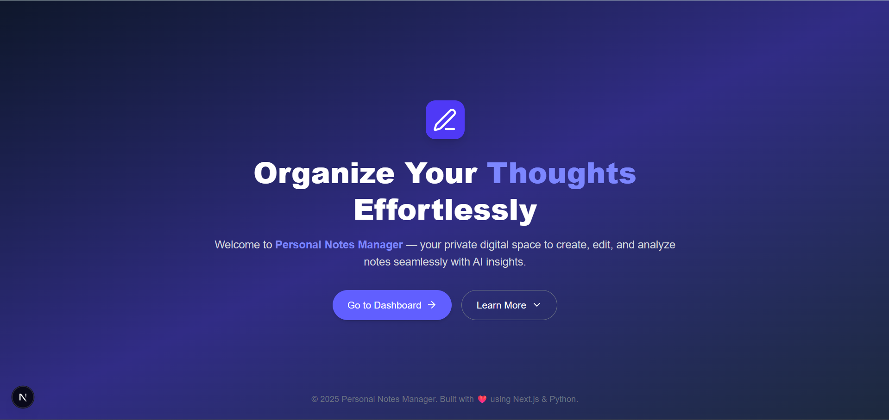

# 📝 Personal Notes Manager

<p align="center">
  
</p>

<div align="center">
  <h3>Organize, search and analyze your notes — powered with optional AI insights.</h3>
  <p>
    <a href="#"></a>
    <a href="#"></a>
    <a href="#"></a>
    <a href="#"></a>
  </p>
</div>

---

## Quick overview

Personal Notes Manager is a privacy-first, full‑stack app. The frontend and primary backend (API routes) are implemented with Next.js; an analytics microservice (optional) is implemented with Python + FastAPI to handle heavier AI/analysis workloads.

## Highlights

- Fast, responsive UI (Next.js + Tailwind)
- Next.js API routes for core backend (auth, notes, token revocation)
- Optional Python FastAPI analytics microservice for AI-heavy tasks
- JWT-based auth with revocation support
- Tags, search and real-time sync support

## Tech stack

- Frontend / Primary backend: Next.js 14, TypeScript, Tailwind CSS
- Analytics microservice: Python (FastAPI)
- Database: MongoDB (primary)
- Auth: JWT with revocation collection
- AI: OpenAI GPT (optional, used by analytics service)

## Quick start (local)

Prereqs: Node.js, Python 3.10+, pip, MongoDB (or use a cloud DB)

1. Clone

   ```bash
   git clone https://github.com/yourusername/personal-notes-manager.git
   cd personal-notes-manager
   ```

2. Run Next.js (frontend + primary API routes)

   ```bash
   cd app
   npm install
   cp .env.example .env.local
   # Edit .env.local (NEXT_PUBLIC_API_URL if needed)
   npm run dev   # runs frontend + API routes (default port 3000)
   ```

3. Run Analytics microservice (Python FastAPI) — optional

   ```bash
   cd backend/analytics
   python -m venv .venv
   source .venv/bin/activate   # Windows: .venv\Scripts\activate
   pip install -r requirements.txt
   cp .env.example .env
   # Edit .env to set DATABASE_URL, JWT_SECRET, OPENAI_API_KEY (optional)
   uvicorn main:app --reload --port 8001
   ```

Open: http://localhost:3000 (frontend & API routes). Analytics service (if running): http://localhost:8001

## Environment (example)

app/.env.local

```
NEXT_PUBLIC_API_URL=http://localhost:3000
ANALYTICS_SERVICE_URL=http://localhost:8001
```

backend/analytics/.env

```
DATABASE_URL=mongodb://localhost:27017/notesdb
JWT_SECRET=supersecretvalue
OPENAI_API_KEY=sk-...
```

## API (who serves what)

Core API (served by Next.js API routes in the app):

- POST /api/auth/register — register user
- POST /api/auth/login — login -> returns JWT
- GET /api/notes — list notes (auth)
- POST /api/notes — create note (auth)
- PUT /api/notes/:id — update note (auth)
- DELETE /api/notes/:id — delete note (auth)

Analytics API (served by Python FastAPI microservice):

- POST /analytics/analyze — analyze/summarize note (accepts note content or note id; calls OpenAI/local model)
- GET /analytics/status — health/status of analytics service

Example request (curl) to Next.js API:

```bash
curl -H "Authorization: Bearer <TOKEN>" http://localhost:3000/api/notes
```

Example request to analytics service:

```bash
curl -X POST http://localhost:8001/analytics/analyze -H "Content-Type: application/json" -d '{"text":"My note text..."}'
```

## Project layout (high level)

```
app/                      # Next.js frontend + primary API routes (auth, notes, token logic)
backend/
analytics/                # Python FastAPI analytics microservice (AI, heavy processing)
public/                   # static assets
docs/                     # documentation & design notes
```

## Contributing & Roadmap

- Fork → branch → PR
- Keep changes scoped; add tests for backend logic
- Roadmap: rich editor, advanced search, reminders, mobile clients

## License & contact

MIT © Sahil Kumar  
Project: https://github.com/augsahil/personal-notes-manager

---

<p align="center">Built with ❤️ • Next.js & Python (FastAPI for analytics)</p>
